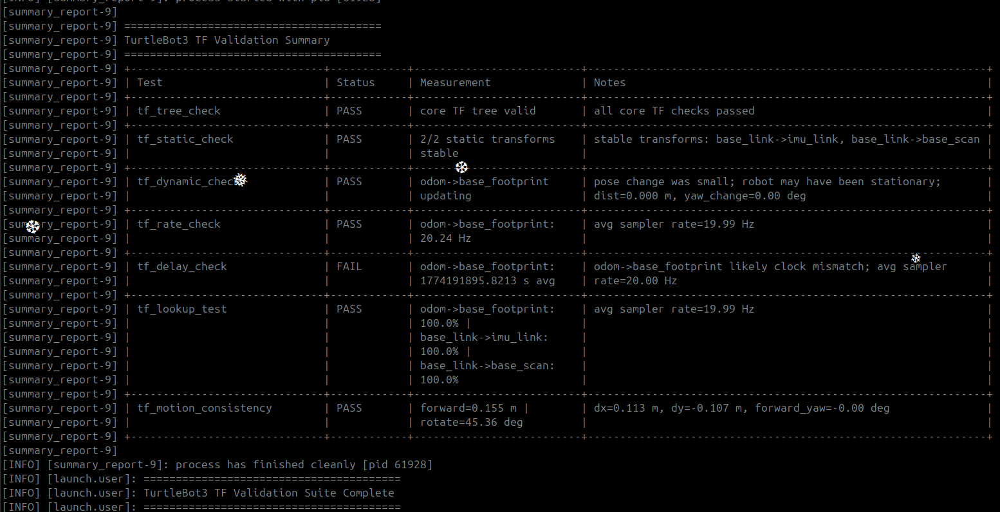
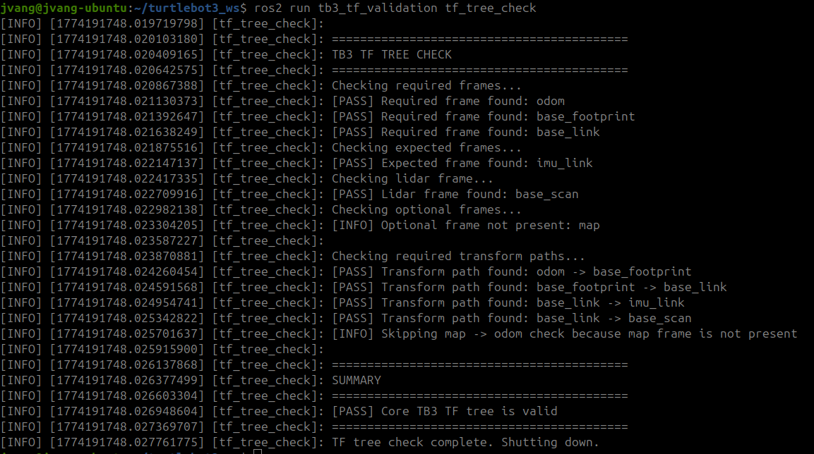
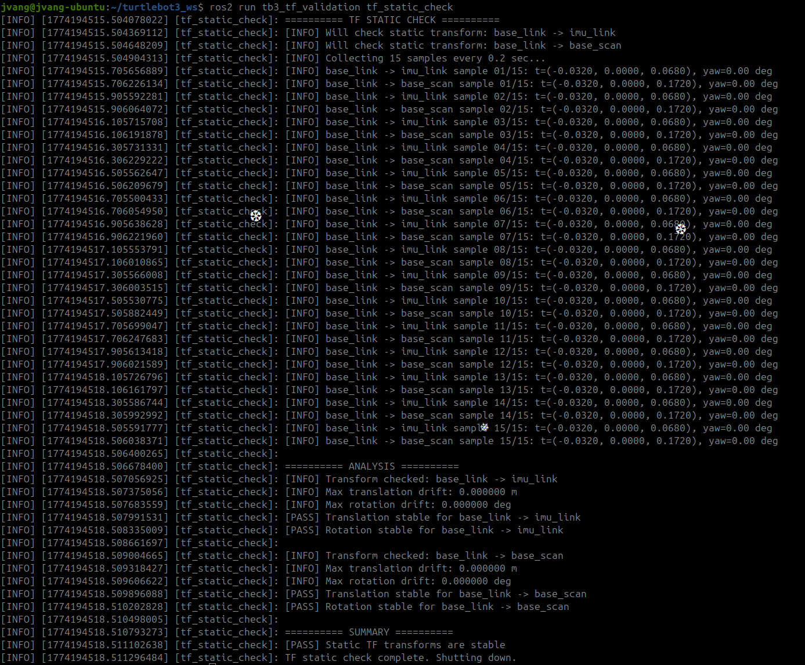
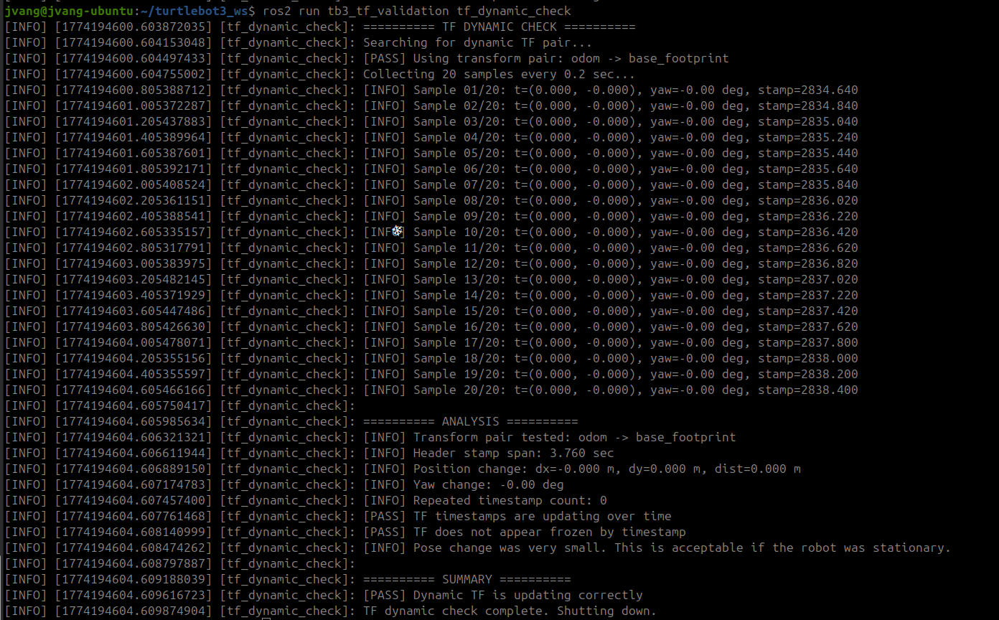
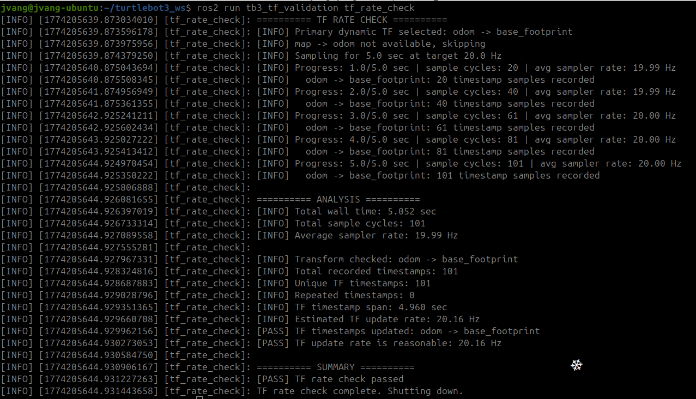
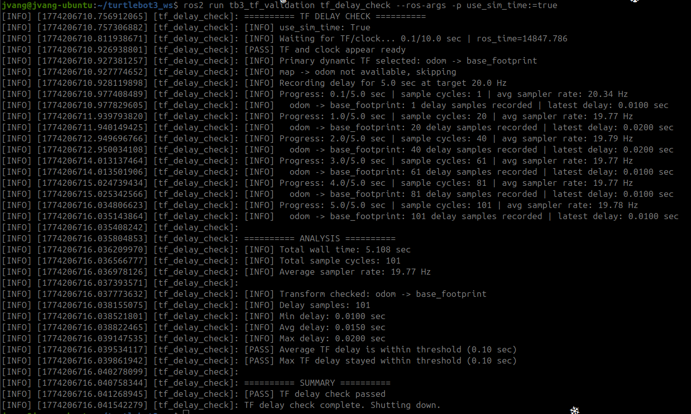
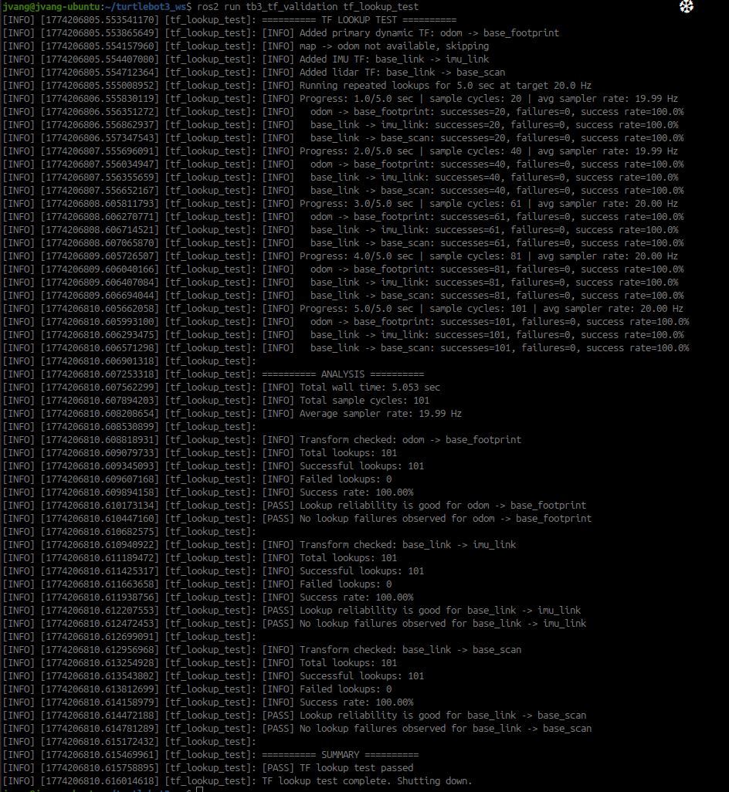
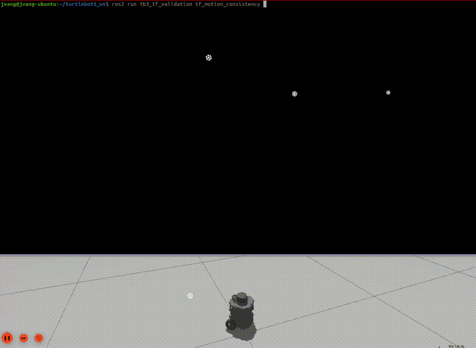

# tb3_tf_validation

A ROS 2 (Jazzy) TurtleBot3 validation suite for checking TF (transform) behavior before using the robot for SLAM, navigation, or higher-level autonomy.

This package validates the health and correctness of:

- TF tree structure and connectivity
- Static transform stability
- Dynamic transform updates
- TF publishing rate
- TF timestamp delay / freshness
- TF lookup reliability
- Motion consistency between commands and TF

---

## Overview

This package contains the following validation tests:

| Test | Description |
|-----|-------------|
| `tf_tree_check` | Verify TF tree structure and required frame connectivity |
| `tf_static_check` | Ensure static transforms remain stable over time |
| `tf_dynamic_check` | Confirm dynamic transforms update continuously |
| `tf_rate_check` | Measure TF publishing rate |
| `tf_delay_check` | Measure TF timestamp delay and freshness |
| `tf_lookup_test` | Evaluate TF lookup reliability over time |
| `tf_motion_consistency` | Compare commanded motion vs TF motion |

---

## Demo

### Full Validation Launch

```bash
ros2 launch tb3_tf_validation tf_validation_all.launch.py
```

Simulation:

```bash
ros2 launch tb3_tf_validation tf_validation_all.launch.py use_sim_time:=true
```

<p align="center">
  
</p>

---

## Individual Tests

### TF Tree Check

```bash
ros2 run tb3_tf_validation tf_tree_check
```

<p align="center">
  
</p>

---

### TF Static Check

```bash
ros2 run tb3_tf_validation tf_static_check
```

<p align="center">
  
</p>

---

### TF Dynamic Check

```bash
ros2 run tb3_tf_validation tf_dynamic_check
```

<p align="center">
  
</p>

---

### TF Rate Check

```bash
ros2 run tb3_tf_validation tf_rate_check
```

<p align="center">
  
</p>

---

### TF Delay Check

```bash
ros2 run tb3_tf_validation tf_delay_check
```

Simulation (IMPORTANT):

```bash
ros2 run tb3_tf_validation tf_delay_check --ros-args -p use_sim_time:=true
```

<p align="center">
  
</p>

---

### TF Lookup Test

```bash
ros2 run tb3_tf_validation tf_lookup_test
```

<p align="center">
  
</p>

---

### TF Motion Consistency

```bash
ros2 run tb3_tf_validation tf_motion_consistency
```

<p align="center">
  
</p>

---

## Topics Used

```text
/tf
/tf_static
/odom
/cmd_vel
/imu
/scan
```

TF pipeline:

```text
map -> odom -> base_footprint -> base_link -> sensors
```

---

## Why This Matters

Before debugging SLAM, AMCL, Cartographer, or Nav2, it helps to verify:

- TF tree is complete and connected
- Static transforms are stable
- Dynamic transforms are updating correctly
- TF rate is sufficient
- TF delay is minimal
- TF lookups are reliable
- Robot motion matches TF output

---

## Installation

```bash
cd ~/your_ros2_ws/src
git clone https://github.com/johnnyjvang/tb3_tf_validation.git
```

```bash
cd ~/your_ros2_ws
colcon build
source install/setup.bash
```

---

## Running on Real TurtleBot3

Terminal 1:

```bash
source /opt/ros/jazzy/setup.bash
export TURTLEBOT3_MODEL=burger
ros2 launch turtlebot3_bringup robot.launch.py
```

Terminal 2:

```bash
cd ~/your_ros2_ws
source install/setup.bash
```

Run full suite:

```bash
ros2 launch tb3_tf_validation tf_validation_all.launch.py
```

---

## Running in Simulation

Terminal 1:

```bash
source /opt/ros/jazzy/setup.bash
export TURTLEBOT3_MODEL=burger
ros2 launch turtlebot3_gazebo turtlebot3_world.launch.py
```

Terminal 2:

```bash
cd ~/your_ros2_ws
source install/setup.bash
```

Run full suite:

```bash
ros2 launch tb3_tf_validation tf_validation_all.launch.py use_sim_time:=true
```

---

## Expected Results

### TF Tree

```text
All core frames connected and resolvable
```

### Static TF

```text
No drift in static transforms
```

### Dynamic TF

```text
Transforms continuously update
```

### Rate

```text
Stable TF publishing rate (~10–30 Hz typical)
```

### Delay

```text
Low delay (<0.1 sec)
No clock mismatch
```

### Lookup

```text
High success rate (>95%)
```

### Motion Consistency

```text
Forward and rotation commands match TF movement
```

---

## Package Structure

```text
tb3_tf_validation/
├── launch/
│   └── tf_validation_all.launch.py
├── docs/
│   ├── tf_launch_output.png
│   ├── tf_tree_check.png
│   ├── tf_static_check.png
│   ├── tf_dynamic_check.png
│   ├── tf_rate_check.png
│   ├── tf_delay_check.png
│   ├── tf_lookup_test.png
│   └── tf_motion_consistency.gif
├── tb3_tf_validation/
│   ├── tf_tree_check.py
│   ├── tf_static_check.py
│   ├── tf_dynamic_check.py
│   ├── tf_rate_check.py
│   ├── tf_delay_check.py
│   ├── tf_lookup_test.py
│   ├── tf_motion_consistency.py
│   ├── reset_results.py
│   ├── summary_report.py
│   ├── result_utils.py
│   └── __init__.py
```

---

## Notes

- Motion consistency test will move the robot
- TF delay check requires sim time in Gazebo
- Results stored at:

```bash
/tmp/tb3_tf_validation/results.csv
```

---

## License

MIT License
